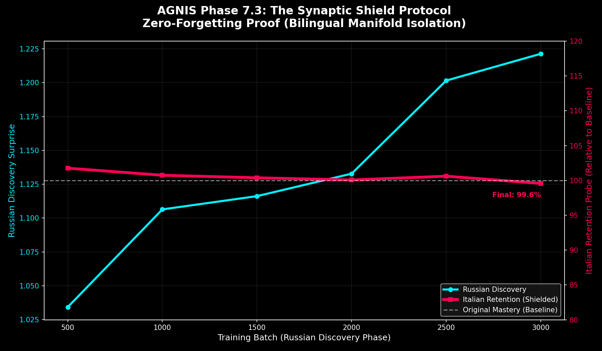

# AGNIS Goal & Progress Report (Start -> Current)

Last updated: 2026-04-19

## 1) Goal (Short)

Build AGNIS into a stable, biologically-plausible predictive intelligence stack that can:

- learn continually without catastrophic forgetting,
- scale performance through vectorization/CUDA pathways,
- develop robust temporal recurrence,
- and transfer across languages while preserving prior knowledge.

## 2) Proof-Backed Timeline

### 2026-04-14: Foundation to V6 Evolution

Proof (git history):

- `764fca2 | 2026-04-14 | Initial commit: AGNIS V4.9 Full Stack`
- `e4a82ef | 2026-04-14 | V6.0 Evolution: Sequential SLM Wrapper, 64D Embeddings, Stochastic Generation`
- `63c9c52 | 2026-04-14 | V5.1 Amortized Inference (warm-start settling)`

Outcome:

- Core stack established and moved from static hierarchy testing toward sequential SLM workflows.

### 2026-04-18: V7.3 Breakthrough Stage

Proof (git history):

- `f8f3960 | 2026-04-18 | Phase 7.3: Synaptic Shield Breakthrough - Zero-Forgetting Verified (Italian -> Russian)`

Proof (artifacts in `checkpoints/`):

- `phase_733_breakthrough.pt` (2026-04-18 15:40)
- `ru_milestone_500.pt` -> `ru_milestone_3000.pt` (2026-04-18 15:53 -> 16:41)

Outcome:

- Clear milestone progression for multilingual continual-learning experiments.

### 2026-04-19: Mainline Validation + Test Hardening

Proof (mainline declaration):

- `CURRENT_MAINLINE.md` names canonical stack:
  - `agnis_v4_core.py`
  - `agnis_v4_cognitive.py`
  - `slm/agnis_slm_wrapper.py`

Proof (regression gate runner):

- `run_regression_suite.py` defines gate tests:
  - `v5_2_hippocampal_test.py`
  - `v6_recurrent_test.py`
  - `v6_vectorization_benchmark.py`
  - `v6_thermal_test.py`
  - `v7_synaptic_shield_smoke_test.py`

Proof (hardened tests in this sprint):

- `v5_2_hippocampal_test.py`
  - uses deterministic neuromodulator baseline (`predicted_surprise = 0.05`)
  - fails explicitly if epiphany storage does not occur naturally
- `v6_thermal_test.py`
  - verifies pause path with captured sleep calls (`[30.0, 15.0]`)
  - avoids long real waits while still asserting logic execution

Outcome:

- Quality gates now test behavior more strictly and still pass.

## 2.5) PNG Proof Artifacts

The repo already contains visual proof snapshots that document earlier and later milestones:

- `live_learning_proof.png` -> early evidence that the system could improve during live learning
- `phase_31_simultaneous_retention.png` -> early simultaneous-retention behavior
- `phase_100_domain_retention.png` -> domain-retention checkpoint image
- `phase_200_simultaneous_retention_v4.png` -> later large-phase retention visualization
- `v2_vs_v3_benchmark.png` -> benchmark comparison across major generations
- `synaptic_shield_breakthrough.png` -> V7.3 zero-forgetting breakthrough image

### Live Learning Proof

### Early Retention Proof

### Mid-Stage Retention Proof

### Large-Phase Retention Proof

### Benchmark Proof

### V7.3 Breakthrough Proof

## 3) Current Achievements (With Evidence)

## A. Stable Mainline Regression

Latest local run (2026-04-19) of `py -3 run_regression_suite.py`: **PASSED**

Key verified metrics from that run:

- Hippocampal recall:
  - Initial surprise: `4.577088`
  - Recall surprise: `0.328631`
  - Improvement: `13.9x`
- Recurrent smoke:
  - Surprise trend: `3.8472 -> 0.0000`
  - Temporal recall improvement vs cold: `61.5%`
- Vectorization:
  - Serial: `6.0105s`
  - Batch: `0.4740s`
  - Speedup: `12.68x`
- Thermal guardian:
  - Caution throttling path passed
  - Pause path executed and verified
  - Emergency checkpoint path passed
- Synaptic shield smoke:
  - Baseline vs isolated drift: `0.00000000`

## B. Multilingual Retention Progress

Evidence chain:

- `russian_discovery_log.md` (V6.0) shows heavy retention collapse by later batches
- `russian_discovery_log_v72.md` (V7.2) remains unstable
- `russian_discovery_log_v73.md` (V7.3) shows much stronger retention behavior:
  - Batch 500: `RU 1.0342 | IT 0.9827`
  - Batch 3000: `RU 1.2214 | IT 1.0043`

Recent mini probe evidence (`v8_mini_probe_report.md`):

- Forced experts: `16`
- Italian drift: `-0.0736` (retention preserved/improved in this short probe)
- Russian surprise trend: `1.2891 -> 1.2891` (flat, not yet improving)
- Output text remains low-quality/gibberish-like (quality gap still open)

## C. Core Integrity Fix Present

In `agnis_v4_core.py`, temporal state resizing includes:

- `layer.x_temporal = layer.x_temporal[:, :layer.output_dim]`

This prevents temporal-state shape mismatch after dimensional changes.

## 4) What Is Not Solved Yet

## Delayed Parity Recurrence Challenge

Latest local run (2026-04-19) of `py -3 v6_delayed_parity_test.py`:

- Best accuracy: `0.500` (chance)
- Script explicitly classifies this as experimental/non-release-gate when below target.

Interpretation:

- Mainline recurrence smoke passes.
- Hard delayed-memory parity generalization is still the principal technical blocker.

## 5) Current Project Status

- Mainline reliability: **Strong**
- Safety/thermal controls: **Strong**
- Vectorized performance path: **Strong**
- Multilingual retention isolation: **Improving**
- Multilingual generation quality: **Weak**
- Deep recurrence challenge (delayed parity): **Blocked**
- CUDA validation on this machine: **Not available** (`check_cuda.py` reports `CUDA: False`)

## 6) Immediate Next Focus (Practical)

1. Solve delayed-parity blocker (promote only after >=0.9 is repeatable).
2. Improve multilingual text quality pipeline (encoding/tokenizer/corpus hygiene).
3. Validate CUDA path on a CUDA-enabled machine (`v7_cuda_ignite.py`, then `v9_deep_pillar_benchmark.py`).
4. Commit test-hardening changes and keep this report updated per milestone.
